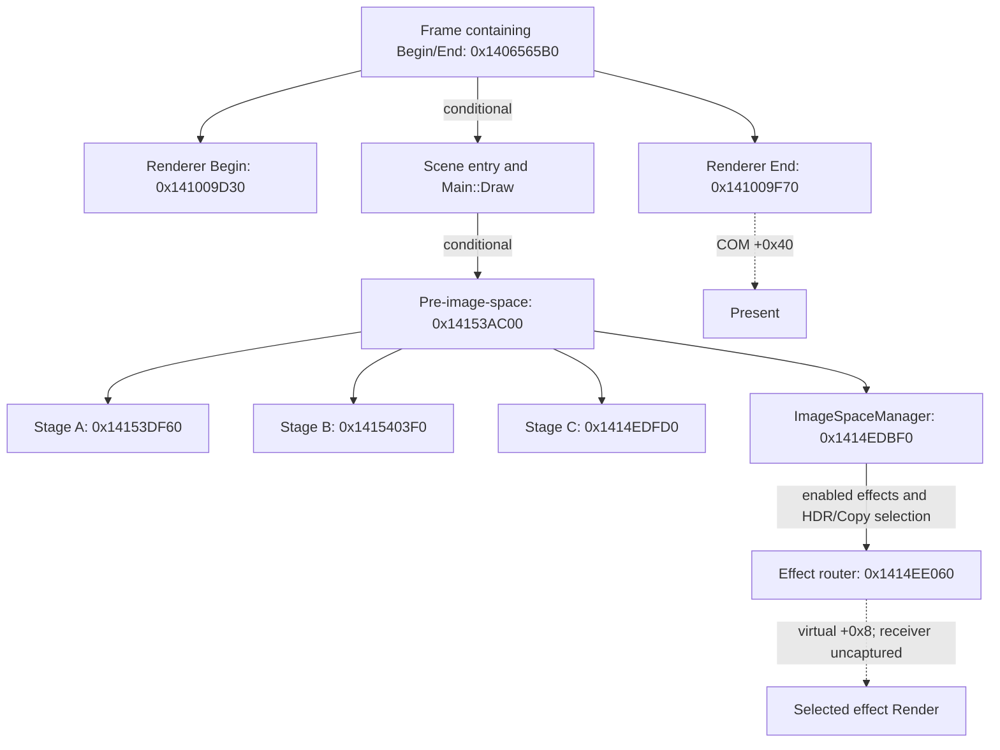

# Native frame topology and capture requirements

This map establishes parts of the native call graph, effect dispatch, input-layout creation and presentation boundary for one Skyrim SE executable. It does not establish a complete frame sequence or the selected state of a retail frame. Every stage still needs runtime evidence before it can support a claim of visual parity.

The analyzed executable is `SkyrimSE.exe` version `1.7.104.0`, image base `0x140000000`, SHA-256 `846efccf0c1374d71f892907f46549560f2fcb0a75cb87a3eed438baa0f1402f`. These findings cover this file. Other SE/AE builds, LE and Skyrim VR need their own binary and capture evidence.

The machine-readable [frame map](frame-topology.json) contains the query hashes, 34 nodes, 27 selected direct edges, branch guards, API boundaries, stage coverage and unresolved work. Eleven read-only queries reused the persistent Ghidra project with analysis disabled. They recovered 130 functions and 1,192 direct calls plus 369 computed calls within those functions. These counts describe the queried functions; they are not complete executable or frame counts.

All 155 file-backed requested spans matched the original executable. Four additional spans refer to data without original file backing. All 36,082 unique exported instruction starts matched the executable bytes. LLVM independently decoded 18,793 instructions across the 130 recovered functions with zero mismatches. No function instruction export was truncated. Saved program analysis remains partial, so a missing reference or function is unresolved evidence.

## Call relationships and conditional routes

The diagram shows verified call relationships and two computed dispatch boundaries. It is not a timeline. Initialization, worker jobs, alternate camera paths and additional frame clients remain separate routes.

| Source → target | Verified callsite | Guard or remaining limit |
| --- | --- | --- |
| Frame `0x1406565B0` → Begin `0x141009D30` | `0x1406565F7` | A containing frame route; other clients also call Begin/End. |
| Frame → scene wrapper `0x140656D10` | `0x140656834` | Requires object field `+0x60` to be nonzero and virtual `+0x380` result to be nonnull; either failure skips to `0x14065684A`. |
| Frame → same scene wrapper | `0x140656A78` | Alternative callsite with a different surrounding route; selected camera and state are uncaptured. |
| Scene wrapper → `0x140656E60` | `0x140656E2D` | This entry has the source-assisted `Main::Draw` label. |
| Scene → job helpers | `0x140656F33`, `0x140656FD2` | Targets are `0x140657C90` and `0x140657930`; scheduling calls do not establish worker completion order. |
| Scene → camera/shadow helper `0x141537FD0` | `0x140657024` | Active light and caster identities remain unknown. |
| Scene → pre-image-space `0x14153AC00` | `0x1406578D1` | Requires bytes at `0x1433D3D12` and `0x1420D6B7C` to be nonzero; branches at `0x1406578A7` and `0x1406578B0` skip to `0x1406578F5`. |
| Pre-image-space → stages A/B/C and manager | `0x14153AD90`, `0x14153ADB0`, `0x14153ADD0`, `0x14153ADE7` | A receives manager object field `+0x170` and target index 43/44; B receives field `+0x188` and output 45; C receives source/output 1; manager receives source 1 and caller-selected output. A/B object types remain unproven. |
| Accumulator `0x14151EF40` → composite stage `0x14153A6B0` | `0x14151F49B` | Selected accumulator state remains unobserved. |
| Composite stage → reflection driver `0x1415419A0` | `0x14153AB75` | The conditional route and shader setup calls are verified; active SSR state remains unobserved. |
| Frame → End `0x141009F70` | `0x140656BB1` | API presentation is inside End; a successful displayed frame has not been observed. |

Target initialization at `0x14153B680` calls target-creation wrapper `0x141015420`, which tail-dispatches to `0x14100A590`. Allocation order does not determine pass order. The target index, resource description, bound view and actual write need to be linked separately.

## ImageSpaceManager dispatch and object identity

`0x1414EDBF0` orchestrates image-space effects. It is not a single HDR shader. The effects array is reached through manager field `+0x28`. Slots 0 through 7 are inspected, with virtual `+0x30` callbacks and LDR conditions controlling execution. The router at `0x1414EE060` uses an index in EDX to choose an entry, binds image-space input/output objects, then invokes virtual `+0x8`.

At callsite `0x1414EDD68`, byte `0x1420D75E4` selects index 30 when nonzero or index 34 when zero. The reference enum names these HDR and Copy. Other effects run through callsites `0x1414EDCC7` and `0x1414EDF54`, subject to enablement and target routing. Live effect pointers, enablement results and target ping-pong have not been captured.

The independent PE RTTI/vtable catalog identifies these possible dispatch receivers:

| Type/subobject | Vtable | Object adjustment | Virtual `+0x8` | Virtual `+0x30` |
| --- | --- | --- | --- | --- |
| `ImageSpaceEffectHDR` | `0x141B443C8` | 0 | `0x14153D120` | `0x14153DCF0` |
| `ImageSpaceEffectVolumetricLighting` | `0x141B47970` | 0 | `0x141553B90` | `0x141550000` |
| `ImageSpaceEffectDepthOfField` | `0x141B48018` | 0 | `0x1415509A0` | `0x141551270` |
| `BSImagespaceShaderHDRTonemapBlendCinematic` image-space subobject | `0x141B364D0` | 144 bytes | `0x141564E30` | `0x14150B480` |

The cinematic shader's main `BSShader` vtable at `0x141B36428` belongs to a different subobject. Its slots cannot be substituted for the image-space receiver's slots. A vtable identifies possible methods; proving a selected method requires the runtime receiver and captured call or draw.

## State application, layout and drawing

The queried geometry route is `0x141560340` → `0x14155F050` → indexed draw helper `0x14100BCD0`. The last edge occurs at `0x14155F1ED` on one conditional drawing branch. Other drawing branches remain open.

The draw helper applies cached renderer state through `0x141010DE0` at `0x14100BD33`, then reaches `DrawIndexed` at `0x14100BDAA`. Render-target setter `0x1410155B0` and depth setter `0x141015670` stage cache values at `0x1420CFC00`; the target setter can request an immediate commit. A staged target index is not proof of an effective output-merger binding. Helper `0x141015790` is a verified no-op, so reaching it does not prove a resource binding.

For the input layout, the state application body intersects the current shader descriptor at shader `+0x48` with global `0x1420CFF40` at `0x1410111EF`. Dirty/cache-miss paths call descriptor builder `0x141011750` at `0x141011255`. That builder supplies descriptors and the selected vertex shader's bytecode/signature to `CreateInputLayout`. Cache helper `0x141013A40` runs conditionally before `IASetInputLayout`.

The authored stream semantic and the component consumed by the shader must both be preserved. For example, the native layout string is `BINORMAL`, while the inspected lighting shader decodes that input's XYZ as retained authored tangent data. The semantic name alone cannot determine the mathematical role. The [input contracts](input-contracts.md) track that distinction.

## API and presentation boundary

The API labels below combine original receiver/operand byte evidence with primary Microsoft SDK C-interface vtable declarations. [The ABI catalog](d3d11-abi.json) pins the headers to `Microsoft/win32metadata` revision `76c04c2021ef4a831a6f1e06d9566002d746139b` and records source hashes and lines. Receiver values and resource identities at runtime remain uncaptured.

| Native callsite | Receiver chain / x64 slot | SDK method |
| --- | --- | --- |
| `0x141011C3C` | Device global `0x143330190`, vtable `+0x58` | `ID3D11Device::CreateInputLayout` |
| `0x1410112AA` | Context global `0x143331F30`, vtable `+0x88` | `ID3D11DeviceContext::IASetInputLayout` |
| `0x14100BDAA` | Context global `0x143331F30`, vtable `+0x60` | `ID3D11DeviceContext::DrawIndexed` |
| `0x14100FE5B` | Device global `0x143330190`, vtable `+0x60` | `ID3D11Device::CreateVertexShader` |
| `0x14100FFC0` | Device global `0x143330190`, vtable `+0x78` | `ID3D11Device::CreatePixelShader` |
| `0x14100A012` | Current-window global `0x143330198`, window `+0x18`, vtable `+0x40` | `IDXGISwapChain::Present` |

The primary declarations are [the D3D11 device vtable](https://github.com/microsoft/win32metadata/blob/76c04c2021ef4a831a6f1e06d9566002d746139b/generation/WinSDK/RecompiledIdlHeaders/um/d3d11.h#L14484), [the device-context vtable](https://github.com/microsoft/win32metadata/blob/76c04c2021ef4a831a6f1e06d9566002d746139b/generation/WinSDK/RecompiledIdlHeaders/um/d3d11.h#L8598), and [the swapchain vtable](https://github.com/microsoft/win32metadata/blob/76c04c2021ef4a831a6f1e06d9566002d746139b/generation/WinSDK/RecompiledIdlHeaders/shared/dxgi.h#L1978).

At Present, `SyncInterval` comes from renderer data global `0x143330188`, field `+0x30`, as a runtime DWORD. It is not a fixed compiled interval. Present flags are explicitly zero. A preceding timing-wait loop is guarded by byte `0x1420D0200`; the selected branch, API return and displayed image remain unknown.

Swapchain creation at `0x141009B00` writes format 28, `R8G8B8A8_UNORM`, at `0x141009BC2`. Backbuffer helper `0x141012480` calls `GetBuffer` at `0x1410124B4`, then creates RTV/SRV views with null descriptions at `0x1410124DA` and `0x141012501`. This endpoint does not apply an sRGB render-target write conversion. It does not resolve the numeric color domain at the recovered tone shader's output, all subsequent copies or the transfer of the displayed image.

Two embedded DXBC buffers also have native creation linkage: `0x1420D3770` flows from consumer `0x1411B2990` to the vertex-shader wrapper, and `0x1420D39B0` to the pixel-shader wrapper. Their creation links are verified; assigning them to UI or a selected draw remains open. See the [embedded shader inventory](embedded-shaders.md).

## Coverage and remaining proof

All rows below lack selected retail execution evidence. Static findings describe verified portions of a path; an unresolved identity, branch or format stays open.

| Stage | Established static evidence | Remaining evidence |
| --- | --- | --- |
| Scene traversal/culling | Scene entry and job-helper calls | Roots, cull predicates, jobs, completion and submitted object identities |
| Depth/prepass | Target and shader references | Selected pass, depth convention, formats, clear/write/compare state and draws |
| Directional/local shadows | Camera, caster and job scheduling helpers | Light/caster selection, cascades, matrices, bias, formats, samplers and receivers |
| Materials/shader selection | Geometry preparation and conditional submission | Material flags, resolved objects/techniques, stage hashes, buffers and texture views |
| Vertex layout | Descriptor intersection, cache, creation and binding chain | Live vertex signature, packed streams, descriptors and authored basis values |
| D3D resources/state | Staging and apply boundaries | Complete creation descriptions and effective bound state at each draw |
| Deferred lighting/composite | Accumulator/composite calls | Selected shader and all light, normal, mask and shadow dependencies |
| SAO/depth fog | Conditional driver `0x141541F40`, camera-Z/AO/blur/composite setup | Enablement, history, constants, selected bytecode and intermediate images |
| Reflections | Driver and source-assisted shader setup identity | Screen/cubemap route, histories, masks, scale, selected shader and composite |
| Sky/atmosphere | Input and shader inventory | Sky/cloud/sun/moon/star draw selection, values and depth/order |
| Water/refraction | Target and shader references | Proven scheduler association, underwater/refraction/reflection paths and resources |
| Transparency/particles | Conditional geometry submission | Complete buckets, sorting, alpha/blend/depth state and fog composition |
| Volumetrics | RTTI/vtable render/setup/enabled entries | Accumulation grid, noise/history, resolution, light/shadow inputs and composite |
| HDR/adaptation/bloom | HDR Render and recovered arithmetic | Full target chain, luminance, history, elapsed time, bloom and selected controls |
| Grading/tone map | Cinematic/fade shader identities and equations | Selected permutation, constants, output domain and later operations |
| Image modifiers/DOF/blur | Effect dispatch and DOF render entries | Resolved modifier stack, enablement, parameters and target order |
| TAA/FXAA | Class/vtable and reference effect identities | Scheduler association, live enablement, jitter, motion vectors, histories and reset |
| Motion blur | Velocity target/effect references | Independent pass identity and evidence of dispatch, if present |
| UI/menus/map/screenshots | Additional Begin/End clients and embedded shader creation | Subsystem association, composition routes, alpha/transfer and ordering |
| Presentation | Present receiver/arguments and UNORM endpoint | Every operation from selected tone output to backbuffer and displayed pixels |
| Stereo/VR | This SE executable's scope is fixed | A separately identified VR package, eye paths and compositor capture |

The `0x14158A*`/`0x14158B*`/`0x14158C*` functions examined in the postprocess drivers are shader setup methods. Calling them does not, by itself, prove shader construction or a selected technique. The queried `0x141539B10` helper also lacks a proven water-system association. These limits prevent reference names from becoming unsupported pass identities.

## Current retail observation route

A read-only Fiji probe at `2026-10-10T09:07:17.823640+00:00` found an installed executable with the same SHA-256 as the analyzed file. Steam, Sunshine, Hyprland and Xwayland were running; Skyrim and RenderDoc were not. OBS and protontricks were available. `renderdoccmd`, `qrenderdoc`, `vkcapture` and `vulkaninfo` were absent from PATH, and no RenderDoc layer appeared in the inspected Vulkan paths. This is a Linux/Proton installation; no native Windows capture route, game startup or GPU capture has been verified.

The inspected preferences configure SAO on, SAO compute off, volumetric lighting on at quality 1, `bUse64bitsHDRRenderTarget=0`, gamma 1, 2560×1440 resolution and vsync on. TAA and FXAA are both off. These are file values, not verified effective runtime settings, and the current profile cannot serve as a presumed vanilla visual baseline. The JSON records the preference hashes and exact keys.

## Capture and continuation requirements

A useful retail capture must identify the executable/DLLs, content precedence, platform/API route, driver, effective settings and modification state. It must also retain worldspace/cell, exact pose and projection, weather transition, hour, active image-space inputs, animation state and the history reset/warm-up procedure.

For each selected event, retain the bytecode hash, resolved shader/effect object, raw constant buffers, typed resources/views and formats, vertex/index streams and input layout, draw/dispatch arguments, viewport/scissor, and blend/depth/raster/sampler state. Capture the scene before HDR, shadow visibility, normal/mask targets, raw/composited AO and fog, reflections, water, volumetrics, luminance/adaptation history, bloom, tone output, subsequent AA/blur/UI/copies and final backbuffer. The required association is event → shader/constants → resources/state → written pixels.

A static edge counts as executed only when a captured event or trace identifies it. A recovered shader equation counts as selected only when its bytecode hash and constants match that event. A target format counts as active only when the bound view, resource description and writes agree. Matching final screenshots alone cannot resolve those boundaries. A Proton/DXVK capture also needs a demonstrated correspondence to the original D3D11 events and resources before it supports a native API equivalence claim.

The next native batches should resolve the pre-HDR object/subpass seeds `0x14153E620` and `0x1415436B0`; close all branches of geometry submission `0x14155F050` and cached-state application `0x141010DE0`; enumerate complete target descriptions from `0x14153B680`; trace effect construction/receiver adjustments through `0x1414EE060`; and connect selected tone output, UI/copies and additional clients to `0x141009F70`. The RGB operand at `0x14331D6F0` also needs object-meaning and writer/consumer closure. Each question and seed is recorded in the JSON.

This investigation did not launch the game, inject a hook, install a capture tool, change a service or tune the renderer. Raw native exports, disassembly and proprietary bytecode remain in private research storage.
