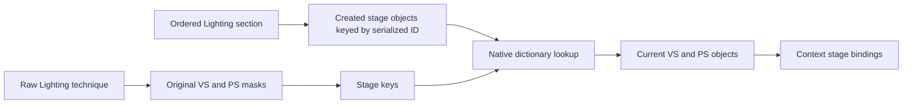

# Native package loading and shader selection

All 135 groups in the recorded `shaders011.fxp` now have original executable evidence connecting constructors, loader names, RTTI vtables, sequential section reads, serialized technique keys and bytecode payloads. [native-shader-loader.json](native-shader-loader.json) contains the addresses, package offsets, hashes and validation results. [shader-selection-backlog.json](shader-selection-backlog.json) retains the unresolved selection and binding work for every group.

This closes static package identity. It assumes the recorded file supplies the opened resource and that object construction and stream reads succeed. No retail resource resolution, selected draw or executed pass was observed. Shader equations, native parameter values and frame scheduling require their own evidence.

## Evidence identity and validation

| Evidence | Identity |
| --- | --- |
| Original executable SHA-256 | `846efccf0c1374d71f892907f46549560f2fcb0a75cb87a3eed438baa0f1402f` |
| Package SHA-256 | `72cfc73eb0938d5949f0b3a8683722a33b671a34b41b750ba138de8d154c5fbc` |
| Native loader proof SHA-256 | `702eed2ee843bf193eb0ba7e83ef302ea6b3b5e7fba1ef18fb2af151f2b697bc` |
| Pinned source revision | `328916305165a46c4e4b527735bbcfd46b09a0ca` |

Native queries used the persistent Ghidra project with analysis disabled and the program read only. Every requested file-backed span matched the original executable. The final validation compared 37,369 distinct original instruction records and independently decoded 153 recovered functions with LLVM 21.1.8. All 27,219 compared function instructions matched; there were no original-byte or independent-decoder mismatches. One early SnowSSS seed used the wrong data address; it was excluded from type and role proofs, and the correct vtable was queried separately.

The older pinned source proposes Lighting vtable RVA `0x187FBD8`. The selected executable's actual primary Lighting vtable is `0x141B47420`. Source addresses were therefore treated as version-specific seeds. Native constructors, pointers and instructions establish the selected target's associations.

## Ordered section loading

Startup function `0x1414EA2D0` formats `SHADERSFX/Shaders%03d.fxp`. The original executable's version dword at `0x1420D6850` is 11. It opens the formatted path through `0x140FE46B0`, then passes the same stream to the nine core section loads below. Constructor loader strings flow into the base shader's field at offset `0x88`; constructed objects are stored in globals and retrieved at each section call.

| Ordinal | Native loader name | Constructor | Startup object global | Section load call |
| ---: | --- | --- | --- | --- |
| 0 | `BloodSplatter` | `0x14152DB90` | `0x1433D3E30` | `0x1414EA80C` |
| 1 | `DistantTree` | `0x141558ED0` | `0x1433D3DF0` | `0x1414EA81D` |
| 2 | `RunGrass` | `0x141522440` | `0x1433D3DE0` | `0x1414EA82E` |
| 3 | `Particle` | `0x1415797F0` | `0x1433D3DF8` | `0x1414EA83F` |
| 4 | `Sky` | `0x1415520E0` | `0x1433D3E20` | `0x1414EA850` |
| 5 | `Effect` | `0x141556690` | `0x1433D3DD8` | `0x1414EA861` |
| 6 | `Lighting` | `0x141547210` | `0x1433D3E28` | `0x1414EA872` |
| 7 | `Utility` | `0x141566460` | `0x1433D3DE8` | `0x1414EA883` |
| 8 | `Water` | `0x14154D080` | `0x1433D3E58` | `0x1414EA894` |

The common section reader, `0x141578F50`, reads two 32-bit counts, then every VS record followed by every PS record. It inserts successfully created objects into stage dictionaries using the serialized technique key. The VS dictionary begins at object offset `0x30`; the PS dictionary begins at `0x60`.

The registration hook at `0x1414ECB00` returns immediately in this executable. Ordered stream reads supply the ordinal evidence.

Startup stores the stream address at `0x143698AA0`, then constructs ImageSpaceManager through `0x1414ED370 → 0x1414ED620 → 0x1414EEE10`. The final function contains 124 ordered shader constructions, including 21 inlined constructions. Each ends through `0x141565200`, which retrieves the shared stream. Its byte test at object offset `0x1A1` selects the VS/PS reader or the compute reader. The original constructors' mode writes agree with every package stage group.

After those constructions consume groups 9–132, function `0x141530F10` loads two final compute sections through `0x141589D80`. Their native names are `ISVolumetricLightingGenerateCS` and `ISVolumetricLightingRaymarchCS`. Groups 81 and 82 have native strings `ReflectionBlurHCS` and `ReflectionBlurVCS`; the historical label list had added an `IS` prefix. The inventory retains those historical aliases.

Package cursor validation covered all 16,044 records and ended exactly at byte 67,768,128. Every serialized key, metadata digest and bytecode digest matches the catalog.

## Native record layouts

Every valid record starts with three 32-bit words: marker `0x11223344`, DXBC byte length and technique key. Native readers consume the following metadata and then the exact declared DXBC slice. No bytecode transformation occurs in the checked creation functions.

| Stage | Creator | Metadata after header | Created object's key field | DXBC storage / use |
| --- | --- | --- | --- | --- |
| VS | `0x14100FC10` | 8-byte vertex descriptor, 20 remap bytes, 4 selector bytes | `+0x00` | Inline at `+0x68`; passed to device slot `0x60` |
| PS | `0x14100FFE0` | 64 remap bytes, 4 selector bytes | `+0x00` | Read into temporary storage; passed to device slot `0x78` |
| CS | `0x1410102D0` | 32 remap bytes, 4 selector bytes | `+0x68` | Inline at `+0x90`; passed to device slot `0x90` |

The compute reader consumes one 32-bit count and inserts successful objects into its dictionary at owner offset `0x28`, using the created object's key at `+0x68`. Device slots correspond to VS, PS and CS creation in the checked [D3D11 ABI](d3d11-abi.json). Constant metadata establishes layout; the allocation, producer and final CB binding still need a separate native chain.

## Lighting keys and binding

Material investigation independently recovered the original Lighting key helpers. For an unsigned 32-bit raw technique:

```text
VS key = (raw & 0x00048007)
       | ((raw & 0x00020A00) ? 0x00000200 : 0)
       | (raw & 0x3F000000)

PS key = (raw & (0xFFFFFE05 | ((raw >> 1) & 0x00000002)))
       | 0x00000001
```

The VS helper is `0x1415896A0`; the PS helper is `0x1415896D0`. Lighting setup `0x141547D20` calls them at `0x141547D81` and `0x141547D8A`, then calls lookup `0x141579120` at `0x141547D9A`. The mask evidence and caller evidence are pinned by SHA-256 in the backlog. All 127 packaged Lighting VS keys and all 6,924 PS keys remain unchanged when passed through their respective native transform. That verifies key compatibility; it does not prove the raw key of a live draw.

Lookup uses `(capacity - 1) & key` to choose a bucket, then checks linked objects' serialized keys. It requires both stage objects unless the vertex-only argument suppresses the PS lookup. A missing required object returns failure. Successful lookup passes the objects to selectors `0x14100FEE0` and `0x141010290`, which retain the current objects at `0x1420CFF48` and `0x1420CFF50` and bind their native stage handles through context slots `0x58` and `0x48`.



Three specific interfaces now have an exact static package-to-object association:

| Catalog program | Record offset | DXBC offset | Bytecode SHA-256 |
| --- | ---: | ---: | --- |
| `group-006.vs.00000000` | 8,468,088 | 8,468,132 | `ffc03a09de2a2ef661b7b7f97ef399ffceaa432f0b834f426b514d132b604e5f` |
| `group-006.ps.00006201` | 9,287,136 | 9,287,216 | `5cc8c639c5993c3f2b1e7a902043c746f4b72365bf5c8cbcad9e8e2ffc9dcbd4` |
| `group-006.ps.00006601` | 9,317,404 | 9,317,484 | `24990d2faa86d0eed41cd9210e5718b0694986825e370adc329cd837023ff806` |

The input signature and material remap contracts for these objects are documented in [input-contracts.md](input-contracts.md). They still need a selected-draw observation to establish which interface runs in a particular scene.

## Remaining selection work

The package loader establishes identities and serialized interfaces. The backlog keeps these separate open edges:

- Native geometry, NIF and pass conditions that produce a raw Lighting technique, plus other families' technique transforms and lookup conditions.
- Each selected program's constant producers, CB allocation and slots, SRV view format and role, sampler state, render targets, blend/depth state and color transfer functions.
- Full shader equations, control predicates, numerical behavior and CPU-side parameter calculations.
- Retail resource resolution, pass scheduling, INI activation, temporal state and actual execution.
- Creation, selection and role links for the remaining 55 bounded embedded occurrences; the two already linked occurrences still have no observed draw.

No rendering code or lighting parameters were changed during this investigation.
