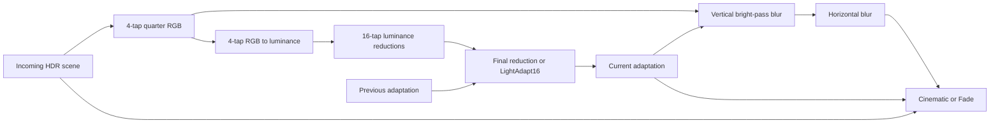

# Skyrim SE/AE image-space: recovered HDR path

This specification defines the recovered ordinary HDR, luminance adaptation, bloom, Cinematic,
and Fade operations for the copied Skyrim SE/AE installation. The CPU packing, shader arithmetic,
and ordinary HDR render graph have static native evidence. Mudcrab can implement this path for
a stable authored image-space record. A complete retail pixel match still requires captures of
the input lighting, sampler state, active settings, and final display transfer.

The implementation is in `crates/engine/src/image_space.rs`, `environment_render.rs`, and
`shaders/image_space*.wgsl`. [Distance fog](distance-fog.md) runs during scene composition;
this path processes the composed scene afterward. [Color pipeline](color-pipeline.md) describes
the Bevy material, exposure, and reflection inputs that remain approximations.

## Evidence and target

Research date: 2026-10-09. Target executable: `SkyrimSE.exe` version `1.7.104.0`, preferred image
base `0x140000000`. Addresses below refer to this executable and are not portable offsets for
other game versions.

| Source | SHA-256 |
|---|---|
| Executable | `846efccf0c1374d71f892907f46549560f2fcb0a75cb87a3eed438baa0f1402f` |
| `Skyrim - Shaders.bsa` | `fd1ba630f443353ed21ed4ca0380968f9c7091c8434518ea3cc79bc6d38c18e7` |
| Embedded `shadersfx/shaders011.fxp` | `72cfc73eb0938d5949f0b3a8683722a33b671a34b41b750ba138de8d154c5fbc` |

The FXP parser reference is revision `328916305165a46c4e4b527735bbcfd46b09a0ca`. Native structure
names are corroborated by CommonLibSSE-NG revision
`b93280e832f263dbef44e44cbe2936622a02f91a` and the matching AE Address Library. Instruction and
byte checks take precedence over historical header comments.

**Record** means an interpreted authored field. **Native** means an operation recovered from
the executable. **DXBC** means an operation recovered from a shipped shader. **Design** means
a Mudcrab resource or integration choice. **Capture required** marks an unresolved runtime or
visual comparison. Raw binaries, shaders, and native listings remain outside the repository.

The shader-family labels use historical archive order correlated with CommonLib effect IDs.
The DXBC programs have no embedded symbolic family names. Their hashes identify the programs;
the labels do not establish a retail frame's active shader selection by themselves.

## Authored fields and stable selection

Modern `IMGS.HNAM` contains nine little-endian `f32` values. `CNAM` contains three, and `TNAM`
contains four. Manager offsets are relative to the live `ImageSpaceManager`, whose data begins
at `+0xC8` in this executable.

| Subrecord offset | Field | Manager offset | Recovered use |
|---|---|---|---|
| HNAM `0x00` | Eye Adapt Speed | `0xC8` | adaptation rate |
| HNAM `0x04` | Bloom Blur Radius | `0xCC` | selects 3–15 blur taps |
| HNAM `0x08` | Bloom Threshold | `0xD0` | per-component bright-pass threshold |
| HNAM `0x0C` | Bloom Scale | `0xD4` | bright-pass multiplier |
| HNAM `0x10` | Receive Bloom Threshold | `0xD8` | tone-stage bloom contribution |
| HNAM `0x14` | White | `0xDC` | tone-curve normalization |
| HNAM `0x18` | Sunlight Scale | `0xE0` | directional shader RGB multiplier |
| HNAM `0x1C` | Sky Scale | `0xE4` | additive sky RGB bias |
| HNAM `0x20` | Eye Adapt Strength | `0xE8` | adaptation rate |
| CNAM `0x00` | Saturation | `0xEC` | Cinematic grading |
| CNAM `0x04` | Brightness | `0xF0` | Cinematic grading |
| CNAM `0x08` | Contrast | `0xF4` | Cinematic grading |
| TNAM `0x00` | Tint Amount | `0xF8` | luminance-based tint |
| TNAM `0x04` | Tint Red | `0xFC` | direct shader RGB |
| TNAM `0x08` | Tint Green | `0x100` | direct shader RGB |
| TNAM `0x0C` | Tint Blue | `0x104` | direct shader RGB |

The older `ENAM` HDR block lacks White and Eye Adapt Strength. Preserve its distinct layout;
do not silently supply modern defaults and call that recovered behavior. The current runtime
requires modern HDR, Cinematic, and Tint inputs.

**Design:** an interior can select its linked `CELL.XCIM` record. An exterior can select one
`WTHR.IMSP` time-key record when the current key is stable or both contributing keys reference
the same `IMGS`. The initial implementation rejects unresolved weather transitions and blends
between different time-key image-space records with a diagnostic reason. Native composition of
those records, modifiers, menus, and special effects is outside this stable-record route.

Weather ambient and sunlight colors are normalized authored `NAM0` bytes without an added sRGB
decode. Applying them to Bevy lights preserves those inputs; Bevy's physical light strengths,
exposure, and BRDF do not prove native lighting. HNAM Sunlight Scale and Sky Scale must not be
used as guessed color corrections; their recovered consumers are documented below.

For supported world IMGS, native ordinary materials preserve unexposed response units
through fog/clamps and HDR composition. The optional `12000/pi` photographic adapter and
camera exposure are bypassed for those materials. Terrain, water and unsupported surfaces
retain Bevy lighting proxies. In authored preview, exposure `pi/12000` maps their
12000-lux diffuse reference and explicit ambient scale into normalized HDR input;
world and reflection cameras switch together. Their BRDF and actual retail light
producer mappings remain full-scene limits. The non-IMGS photographic preview
keeps its explicit adapter and EV100 9.7.

## Settings and CPU packing

Every setting below has native section suffix `:Display`. Values are initialized executable
values, verified from the Setting's value storage and name pointer. They are defaults for the
implementation; they are not a capture of the running game's loaded INI overrides. Decimal
`1.1`, `1.4`, `0.4`, and `0.3` denote their corresponding binary32 values.

| `[Display]` key | Initialized value | Use |
|---|---|---|
| `bUseFilmicCurve` | false | filmic versus Reinhard curve |
| `bUseMultipleLuminanceReferences` | true | ordinary adaptation target minimum 2×2 |
| `bUse64bitsHDRRenderTarget` | false | packed versus 64-bit HDR intermediates |
| `fReinhardWhiteScale` | 1.1 | Reinhard white normalization |
| `fFilmicWhiteScale` | 1.4 | filmic white normalization |
| `fGlobalEyeAdaptSpeedScale` | 2.0 | multiplies authored adaptation speed |
| `fGlobalEyeAdaptStrengthScale` | 0.4 | multiplies authored adaptation strength |
| `fConstHDRAdaptTimerForMenu` | 0.3 | conditional adaptation-time override |
| `fGamma` | 1.0 | reciprocal exponent at final RGB operation |
| `fGlobalSaturationBoost` | 0.0 | added to authored saturation |
| `fGlobalBrightnessBoost` | 0.0 | ordinary brightness addition |
| `fGlobalContrastBoost` | 0.0 | ordinary contrast addition |
| `fGlobalBloomThresholdBoost` | 0.0 | ordinary bright-pass threshold addition |
| `fGlobalMapBrightnessBoost` | 0.25 | alternate brightness addition |
| `fGlobalMapContrastBoost` | -0.3 | alternate contrast addition |
| `fGlobalMapBloomThresholdBoost` | 0.25 | alternate bright-pass addition |

**Native:** internal byte `0x14343635E` selects ordinary versus alternate brightness, contrast,
and bloom-threshold additions. Its external owner is unresolved. A setting's Map name is not
enough to implement that selector from a guessed camera or UI state.

`ImageSpaceEffectHDR::UpdateParams` at `0x14153D860` packs these CPU pixel vectors. The live
manager pointer is stored at `0x1433D40A0`.

| CPU vector | Tone shader register | Value |
|---|---|---|
| 0 | `cb2[0]` | `(0, 0, 0, 0)` for the ordinary HDR tone draw |
| 1 | `cb2[2]` | `(ReceiveBloomThreshold, WhiteCoefficient, float(bUseFilmicCurve), 0)` |
| 2 | `cb2[3]` | `(Saturation + boost, 0, Contrast + selectedBoost, Brightness + selectedBoost)` |
| 3 | `cb2[4]` | `(TintRed, TintGreen, TintBlue, TintAmount)` |
| 4, Fade only | `cb2[5]` | `(FadeRed, FadeGreen, FadeBlue, FadeAmount)` |

Tint RGB and amount are copied directly. No normalization was observed; the tint is
luminance-based, not necessarily luminance-preserving. Fade fields come from manager offsets
`0x11C`, `0x120`, `0x124`, and `0x118`. A positive native Fade Amount selects the Fade child;
the shader applies its blend to RGBA.

For authored white `W`, define:

```text
F(z):
    x = max(z - 0.004, 0)
    return x * (6.2*x + 0.5) / (x * (6.2*x + 1.7) + 0.06)

Reinhard WhiteCoefficient = 1 / (W * fReinhardWhiteScale)^2
Filmic WhiteCoefficient   = F(W * fFilmicWhiteScale)^(-2.2)
```

The native filmic exponent is negative here. The shader later multiplies the corresponding
positive-power curve by this coefficient.

### Constant upload proof

The native vector setter at `0x14152B170` writes four floats at `pixelConstantGroup + 16*i`;
the group is reached through the parameter object's `+0x40` field. The runtime PixelShader
stream creator at `0x14100FFE0` reads the 64-byte metadata table into `PixelShader + 0x40`
at `0x1410100A5–0x1410100B2`, followed by flags and DXBC.

`BSImagespaceShader::SetupGeometry` at `0x141564A80` uses metadata byte `i` as a float offset
for CPU vector `i`, then binds the populated pixel constant buffer to slot 2. The Cinematic
table starts with float offsets `0, 8, 12, 16`; Fade adds `20`. Thus CPU vectors 2 and 3
map to `cb2[3]` and `cb2[4]`. This is a per-shader remap, not a uniform prefix added to every
CPU vector. Historical PixelShader header offset comments must not override these instructions.

## Native HDR graph and resource formats

`ImageSpaceEffectHDR::Render` at `0x14153D120` establishes the ordinary graph. Shader effect
texture index 0 is the output; input index `i+1` becomes pixel texture slot `i`. Confusing the
effect texture array with shader resource slots reverses the tone stage's scene and bloom inputs.



1. `HDRDownSample4` averages incoming scene RGB into RT26, `HDR_DOWNSAMPLE0`. Its dimensions
   are `max(2, ceil(mainDimension/4))`. This common quarter-resolution RGB is used by both
   luminance and bloom.
2. `HDRDownSample4RGB2Lum` reduces that quarter RGB again and converts it to luminance.
   Subsequent `HDRDownSample16Lum` stages reduce the scalar luminance.
3. Every later dimension is `max(minimum, ceil(previousDimension/4))`. The ordinary minimum
   is 2 when `bUseMultipleLuminanceReferences` is true and internal byte `0x14343635D` is clear;
   otherwise it is 1.
4. On the first frame, finish the final luminance reduction and use its result as history.
   On later frames, `HDRDownSample16LightAdapt` **replaces the final reduction**. It samples
   the preceding larger stage and previous history into the final minimum-sized output.
5. Vertical BrightPassBlur writes RT22, `HDR_BLURSWAP`; horizontal ordinary Blur writes RT24,
   `HDR_BLOOM`. Their dimensions use `floor(mainDimension/4)`, so odd main dimensions can make
   RT26 one texel larger than the bloom targets.
6. Tone shader bindings are `t0 = RT24 bloom`, `t1 = incoming HDR scene`, and `t2 = current
   adaptation`. The tone output is the parent effect's output texture.

**Native:** target setup at `0x14153B680` selects DXGI format 26, `R11G11B10_FLOAT`, when
`bUse64bitsHDRRenderTarget` is false, and format 10, `R16G16B16A16_FLOAT`, when true. The same
selected format is used for the reduction pyramid, adaptation history, and bloom. Quantization
occurs at each stored intermediate. An RGBA32Float history texture does not reproduce that
precision. The packed format has no stored alpha channel.

**Design:** Mudcrab uses per-view resources and an explicit clamp-linear sampling helper to
isolate viewports that share a target. The native sampler descriptor and dynamic-resolution
sampling remain independent gates. If the adapter cannot render the packed HDR format, a
reported RGBA16Float fallback is a compatibility choice, not packed-format parity. Native render
target creation does not establish the encoding of the engine's Bevy scene input or swapchain.

## Luminance reduction and temporal adaptation

All recovered luminance dot products use binary32 weights `(0.2125, 0.7154, 0.0721)`.
The four-tap offsets, in source pixels, are `(-1,-1), (1,-1), (1,1), (-1,1)`, each with weight
`1/4`. The sixteen-tap offsets form a Cartesian grid with coordinates
`{-1.5, -0.5, 0.5, 1.5}`, each with weight `1/16`. Sampling UV is
`uv + tapOffset / sourceDimensions`.

`RGB2Lum4` takes the weighted luminance of four source RGB samples. `Lum16` takes the weighted
sum of sixteen source red components. Both write the resulting scalar to XYZ. Native
`cb2[6].z`, used as output alpha, is set to zero. The adaptation shader's initialized extrema
sentinels are overwritten by the weighted accumulation; they do not implement min/max
luminance tracking.

### First history and final-stage replacement

The native history owner is an `ImageSpaceTexture` at `0x1420D7608`. Its invalid target index
indicates absent history. First history receives the newly reduced scene luminance; there is
no recovered fixed clear value such as `(1,1)` or `(0.18,0.18)`.

With valid history, the parent branches at `0x14153D3D6` before rendering the final ordinary
reduction. For example, it retains an 8×8 luminance source and runs LightAdapt16 from 8×8 plus
old 2×2 history into new 2×2 history. Running Lum16 to 2×2 first and then sampling that 2×2
again changes the spatial references. Renderer recreation and the native reset byte
`0x14343635F` invalidate history. Weather-record changes alone were not proven to reset it.

Let `T` be the sixteen-tap current luminance sum and `P` the sampled old history XY. The
adaptation output is:

```text
speed    = EyeAdaptSpeed    * fGlobalEyeAdaptSpeedScale
strength = EyeAdaptStrength * fGlobalEyeAdaptStrengthScale
exponent = time * 30

rateY = 1 - pow(max(1 - speed*0.01, 0), exponent)
rateX = 1 - pow(max(1 - (0.01/strength)*speed, 0), exponent)

d     = (T,T) - P
r     = (rateX,rateY)
step  = sign(d*r) * min(abs(d), max(abs(d*r), 1/256))
outXY = P + step
outZ  = T
outW  = 0
```

If the shader's accumulated XYZ is NaN, it retains `P` for output XY. The native register
mapping is `cb2[2].z = rateY`, `cb2[2].w = rateX`, and `cb2[6].xy = 1/sourceDimensions`.
There is no native zero-strength guard here. The tone shader also has no guard around its
division by adaptation X. Runtime validation or protective behavior must be documented as
a project policy instead of being added to the recovered equation silently.

### Time source and conditional override

**Native:** the main loop copies callback channel 1 to adaptation time `0x1420D68D4`.
The installed callback at `0x14065F530` returns world-frame seconds `0x143275608`, corroborated
by `GetSecondsSinceLastFrame` and AE Address Library ID 410199. It returns zero when the
supplied internal freeze flag is set.

The HDR updater substitutes `fConstHDRAdaptTimerForMenu` when pointer `0x14219E5C0` is nonnull
and its `+0x160` counter is positive. The owning pause/menu transitions are not independently
recovered. **Design:** normal stable gameplay uses frame seconds. A complete implementation
must later supply the proven freeze and conditional override behavior; a fixed real-time
adaptation loop cannot claim those modes.

## Bloom

The HDR parent truncates the authored radius before choosing a blur effect:

```text
r = clamp(trunc(BloomBlurRadius) - 1, 0, 6) + 1
N = 2*r + 1
threshold = BloomThreshold + selectedBloomThresholdBoost
scale = BloomScale
k = native framebuffer scale
```

It selects `BlurBrightPass3` through `BlurBrightPass15`, whose first child is a vertical
BrightPassBlurN and second child a horizontal ordinary BlurN. Generic blur code can interpolate
weight tables, but this HDR route supplies integer `r`.

For first-pass source `S_i`, tap weight `w_i`, and adaptation sample `A`:

```text
BrightRGB = k * sum_i(w_i * max(S_i.rgb/k - threshold, 0) * scale)
BrightA   = dot(A.rgb/k, luminanceWeights)

BlurRGB = k * sum_i(w_i * BrightSample_i.rgb/k)
BlurA   = sum_i(w_i * BrightSample_i.a)
```

The threshold is subtracted from each RGB component, not from source luminance. Bright-pass
alpha is independent of the threshold, scale, final RGB multiplier, and blur weights. Native
BrightPass `t0` is quarter RGB, `t1` is adaptation; ordinary Blur `t0` is the vertical result.
The tone stage consumes bloom RGB only, but RGBA16 intermediates must preserve the native alpha.

The shaders receive `cb2[1] = (remapFlag, 0, k, 1/k)`. The scale global is `0x1420D694C`,
initialized to binary32 `0.8333333134651184`; initialization alone does not establish its active
runtime value. The prior [fog specification](distance-fog.md) records its shared role.

### Shipped weights

The following rows give weights for offsets `-r` through `0`; mirror the noncentral values
for positive offsets. Values are exact decimal representations of the recovered binary32
constants. Use these values without renormalizing their slightly rounded sums or substituting
a Gaussian approximation.

| r | Weights at `-r … 0` |
|---|---|
| 1 | `0.10650672018527985, 0.7869857549667358` |
| 2 | `0.054488569498062134, 0.24420148134231567, 0.4026199281215668` |
| 3 | `0.03663276880979538, 0.11128067970275879, 0.21674521267414093, 0.270682156085968` |
| 4 | `0.027630489319562912, 0.06628213822841644, 0.12383159250020981, 0.1801738291978836, 0.20416367053985596` |
| 5 | `0.022190501913428307, 0.04558895528316498, 0.07981137186288834, 0.11906463652849197, 0.15136076509952545, 0.16396722197532654` |
| 6 | `0.01854398101568222, 0.034166909754276276, 0.05633172020316124, 0.0831085816025734, 0.10971923172473907, 0.12961795926094055, 0.13702280819416046` |
| 7 | `0.01592836156487465, 0.027077801525592804, 0.04242321476340294, 0.061254777014255524, 0.0815124660730362, 0.09996680915355682, 0.11298855394124985, 0.11769580096006393` |

## Cinematic and Fade equations

Let `c` be pixel buffer `cb2`, `p` shared buffer `cb12`, and `w` the luminance weights. Native
samplers are `s0`, `s1`, and `s2` for resources `t0`, `t1`, and `t2`. The native UV remap is:

```text
q = min(max(uv * p[43].xy, 0), (p[44].z, p[43].y))
S = sample(t1, s1, q).rgb
B = sample(t0, s0, c[0].x > 0.5 ? q : uv).rgb
A = sample(t2, s2, uv).xy
```

The recovered tone and grading arithmetic is:

```text
L = max(dot(w,S), 0.00001)
E = L * (A.y/A.x)

if c[2].z > 0.5:
    mapped = c[2].y * exp2(2.2 * log2(F(E)))
else:
    mapped = E * (1 + c[2].y*E) / (1 + E)

C = S * (mapped/L) + B * saturate(c[2].x - mapped)
Y = dot(w,C)
D = Y + c[3].x * ((C,1) - Y)
H = D + c[4].w * (Y*c[4] - D)
J = A.x + c[3].z * (c[3].w*H - A.x)

V.rgb = exp2(p[42].x * log2(saturate(J.rgb)))
V.a   = J.a
```

Scalar terms broadcast across vectors. `D`, `H`, and `J` are RGBA, so saturation, tint,
brightness, and contrast also affect output alpha. `A.x` is the contrast pivot and exposure
denominator; `A.y` is the exposure numerator. These are luminance values, not EV100.

Cinematic outputs `V`. Fade outputs `V + c[5].w*(c[5] - V)` across RGBA, without another
clamp. RGB saturation follows DXBC behavior, including NaN-to-zero. Output alpha is not
saturated. Shared `p[42].x` is reciprocal `fGamma:Display`, packed by `0x14100AE80`.

**Design:** the engine makes its scene scale explicit and disables Bevy tone mapping while
this camera-owned path runs. Its current display bridge treats native normalized RGB as
display-encoded and decodes it before Bevy's sRGB target store. This prevents a second encoding
under that assumption. The [native texture/target trace](../../research/skyrim-native-texture-transfer-20261010.md)
verifies a `RGBA8_UNORM` swapchain with inherited UNORM RTV/SRV views. It supplies no automatic
hardware sRGB write conversion. The intervening final pass chain and the meaning of its RGB
remain unresolved; this bridge must remain distinguishable from recovered register arithmetic.

`--image-space-output display-encoded` preserves that default bridge.
`--image-space-output linear` is an explicit diagnostic that treats the HDR result as linear
and lets Bevy's target encode it. It changes only `display_encoded`, leaving authored grading,
adaptation, bloom inputs and light normalization unchanged. The option does not enable image
space by itself. A brighter result from this diagnostic does not establish retail semantics.

Opt-in GPU diagnostics read the scene input before the image-space write and replay the
shared tone and display-bridge arithmetic into an `RGBA32Float` diagnostic target. The
`native_tone_rgba` and `display_bridge_rgba` fields are arithmetic results, rather than
production output texture dumps. They precede Bevy tone mapping, FXAA and upscaling/output.
The authored preview camera enables default FXAA even when native HDR is selected;
receipts record the observed camera settings and distinguish pipeline readiness from pass
execution. Direct float-to-PNG equality requires validating the remaining output chain or
explicitly controlling it in a test profile. Returned GPU coordinates establish sample
location; they do not establish the screenshot's GPU copy frame or remove subsequent filtering.

## Source light and atmosphere scales

The native Lighting consumer packs directional RGB as `NiLight.diffuse.rgb * NiLight.fade *
SunlightScale`. Its representative shader then multiplies that RGB by the clamped normal/light
dot product. The engine applies the selected stable IMGS multiplier to its weather-colored
world sun. Bevy's `12000`-lux baseline, native diffuse/fade production and complete material
shading remain separate source-lighting limits; this evidence supplies no lux conversion.

The native representative Lighting program adds directional RGB to a directional ambient
transform with coefficient 1 for each. Ambient RGB is three dot products between uploaded
`cb2[11..13]` rows and `float4(normal,1)`. The native uploader reads a three-by-three matrix
plus translation. The consolidated converter retains the weather's four ordered DALC sets,
and the imported lighting work recovered byte transfer, affine matrix preparation and upload.
Authored native preview evaluates those rows with live additive ambient assumed zero;
interior CELL/LGTM cube precedence and effective native unit mapping remain unresolved.
The PBR fallback's scalar ambient uses the cube's constant terms and remains an approximation.
See the [lighting and shading hub](lighting-and-shading.md) and
[environment preparation evidence](../../research/skyrim-environment-preparation-20261009.md).

For atmosphere technique 8, the native sky equation is:

```text
weighted = vertexColor.x*C0.rgb + vertexColor.y*C1.rgb + vertexColor.z*C2.rgb
D = sample(t2,s2,SV_POSITION.xy*0.125).r*0.03125 - 0.0078125
RGB = k*weighted + k*SkyScale + D
alpha = vertexColor.w*C0.a
```

`k` is the framebuffer reciprocal already used by fog. Clear day Sky Scale `0.05` adds about
`0.0416667` to each channel at the initialized `k`; it does not multiply RGB by `0.05`. The
opt-in engine dome now applies the recovered scale and additive bias. Native dither texture
contents and sampler translation remain unresolved, so that term remains omitted. The dome's
analytic interpolation remains a geometry approximation.

The native fog packer copies Near/Far RGB unchanged and packs `k` separately. Its shader's
opaque far endpoint is `k*FarRGB`. The engine uses that endpoint for its background fallback;
the retail clear-color producer remains unverified. Sky Scale is not applied to fog RGB or
ambient-light strength.

## Validation and acceptance

On Apple M1 Pro/Metal, all 12 original scalar fixtures pass with maximum float error
`2.3841858e-7`. Seven camera/render-graph cases pass all ten sampled RGBA8 regions exactly
in RGBA16Float mode. The same seven cases also pass in explicitly required packed
R11G11B10Float mode, with maximum sampled error one code value. Cases cover measured first
history, retained temporal history, bloom at an odd target
size, nonuniform final-reduction ownership, tint/alpha, reflection exclusion and shared-target
viewports. These verify the implemented arithmetic and sampled graph behavior. They do not
establish retail pixel parity or exhaust every radius, precision and lifecycle case.

The production probe must cover both curve modes, direct Tint inputs, nonunit gamma, RGBA Fade,
unsaturated alpha, first history, subsequent history, both luminance-reference minima, both
available HDR precisions, bright-pass threshold and every radius, and a viewport with a nonzero
origin. Disable/re-enable and resize must not reuse stale history or leave camera tone-map
ownership behind. An unsupported packed format must report its fallback.

One independent RGBA16Float fixture uses a 64×64 image at gray `0.25`, with a gray `0.75`
rectangle at inclusive pixel coordinates `x = 8…23`, `y = 8…23`. Clamp-linear pixel-center
sampling and per-stage half quantization give this final 2×2 luminance history:

```text
0.3203125   0.2734375
0.2734375   0.2578125
```

For a static image, correctly replacing the final Lum16 stage makes every temporal delta zero;
the history stays unchanged with positive rates. With curve scale, saturation, and brightness
equal to 1, contrast 2, no tint or bloom, and reciprocal gamma 1, tone RGB at `(40,12)` and
`(12,40)` is `0.215576171875`. At `(40,40)` it is `0.23314666748046875` before final half
storage, or `0.233154296875` after that storage. These are analytical fixture values, not captured
Skyrim pixels. The gray fixture detects an erroneous extra reduction of final history; it does
not alone prove luminance-conversion placement because linear gray filtering can commute.

Retail acceptance additionally requires the active weather/IMGS and loaded settings, input and
intermediate resource domains, native sampler/dynamic-resolution state, world/first-person/
reflection ownership, modifiers and time-key blends, and the final target transfer. Material,
sun, sky, fog, and shadow differences must be assessed independently; a tone-stage match cannot
certify them or justify a compensating hue change.

## Shader identity

All listed pixel programs have technique `00000000` in the copied package. Family labels retain
the historical-order qualification above.

| Pixel program | SHA-256 |
|---|---|
| ISHDRTonemapBlendCinematic | `1def29cca7e582b149a09bd15524793593293ae2d94fc20b3d030bf9f91e39fc` |
| ISHDRTonemapBlendCinematicFade | `781978201a0b01ba4107b11abbe52456b5f20b49b998f1d0ba7aa9d057133ea1` |
| ISHDRDownSample4 | `1abfac94c1717bd663ede710a11b5532384f1183dd11a141f9ac3aebb031d733` |
| ISHDRDownSample4RGB2Lum | `8c90ec91eb391f64b73cea0d3335cdbc92189ea4ae06c08727d193c8c69d1825` |
| ISHDRDownSample16Lum | `1e13dda0aeb8fdcd435b8d682ff2b9fa97fe670fd2d3cd382430fa8a591f6519` |
| ISHDRDownSample16LightAdapt | `675f8c78eab2aa9a0877d6a55185d82911a66b7fc91569dc1331e8916ee2adda` |
| ISBrightPassBlur3 | `52ca43062521325217108af7285d71810fb780693c9adb8b4ede39351b739375` |
| ISBrightPassBlur5 | `3eab75009e54616e8b739e8bb8f037a244f6b0b96b563f697ff75d5a46d285dd` |
| ISBrightPassBlur7 | `1b78f2c3d25d7b516dbb163cc535531baa922e8fa3e444c6b26089edc0e53a77` |
| ISBrightPassBlur9 | `1f812a01fbac3a4bbec88c70fa97c8b6d66aeba0baaf759a652eaf5a233d6c3a` |
| ISBrightPassBlur11 | `6a66612bd620e38005da9d5915e008725618a467cc48f3519d6f49ab2c9bd205` |
| ISBrightPassBlur13 | `320199c9c0a72ec3d76d31c6085ae4ba466b683f359fe1716382470531aa13d4` |
| ISBrightPassBlur15 | `34bf3284b2444c1dfee81a6ea370bb201186763d9739dbb1576e219869fa8cbe` |
| ISBlur3 | `e0fcd2736b37e57e1605a58728fdb5a8296068f949d769d002b3093d9623a7cf` |
| ISBlur5 | `06baab118ce8860f7fc8db5cca431711bd73610dd652be4614a497867b0dba4c` |
| ISBlur7 | `34ef0156d7a97fb14217ff031200560006ae3e0b8cf5e804126b82ba2862703f` |
| ISBlur9 | `1f9cf15745f63f57ab92e1ad47fe4cd32839eb0b933c0bf5cd9a763a538a8cc3` |
| ISBlur11 | `c5d991b1f48cdfff90785d339854bdfb622c1f1b9407a4703302bb22da857d05` |
| ISBlur13 | `6907f081e7dd117cf4f93e064e0394967cf26af7abcea6b5a45d7335d86cdac9` |
| ISBlur15 | `9f756b5e779e1352643321c206387c74d126b016f3b5b4db9e864116b92351d6` |
